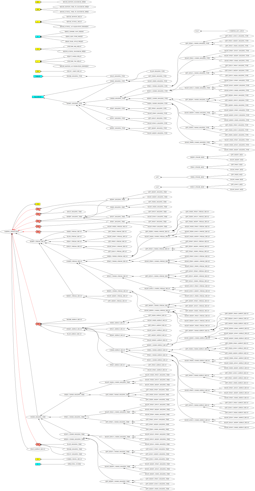

# "Glorious Engrammer" keymap for MoErgo Glove80

This is [my Glove80][1] keymap featuring the [Engram][2]/[mer][3] 
layouts with [Miryoku][4]-style layers and [home row mods][5].
Other layouts (QWERTY, Dvorak, and Colemak/DH) and 
familiar keys (arrows, pinky shifts, function row) 
are also provided as "training wheels" to aid your
transition to the full glory, at your convenience.

>

[1]: https://sunaku.github.io/moergo-glove80-keyboard.html
[2]: https://sunaku.github.io/engram-keyboard-layout.html
[3]: https://sunaku.github.io/engrammer-keyboard-layout.html
[4]: https://github.com/manna-harbour/miryoku
[5]: https://sunaku.github.io/home-row-mods.html

## Keymap

https://my.glove80.com/#/layout/user/f3b57315-c3e5-4e75-89ba-07ebb9f84551

### Legend

See [interactive layer map][6] for overview and documentation.  
>NOTE: This is also available as a [printable PDF document][7].

See [release notes][8] for a visual overview of recent updates.

[6]: https://sunaku.github.io/moergo-glove80-keyboard.html#layers
[7]: https://sunaku.github.io/moergo-glove80-keyboard-layers.pdf
[8]: https://github.com/sunaku/glove80-keymaps/releases

## Installing

Open the [keymap link above](#keymap) and follow these instructions:
1. Log in (account is required)
2. Clone the keymap to customize and/or build it!
3. Choose your base layout (place at top as layer number #0) via drag & drop.
4. Customize the keymap behavior in this text box.
5. Build the firmware and download the `*.uf2` file.


### Flashing

- For the initial flash, follow "Loading new ZMK firmware onto your Glove80"
(see page 28 of the [Glove80 User Guide]) or, if that doesn't work, try the
"bootloader mass storage device mode" method (see page 31 in the user guide).

- If you're installing a different firmware version compared to what your
keyboard currently has, then ⚠️ **after flashing both halves** ⚠️ perform a
"Configuration Factory Reset" on both halves (see page 41 in the [Glove80 User
Guide]) and then turn RGB effects on, watch them illuminate, and finally turn
them back off.  This allows the newly installed firmware to take full effect.

[Glove80 User Guide]: https://www.moergo.com/files/glove80-user-guide.pdf

## Upgrading

- Copy the ZMK snippet from the "Custom Defined Behaviors" text box in either
keymap linked above and paste into yours.  The contents of that text box are
also available in the `*.dtsi` files provided in this Git repository.

- You can diff and copy changes between a JSON export of your keymap (via
"Advanced Settings" > "Enable local config" then go back to "Edit" and click
"Download") and the `*.json` files provided in this Git repository.

## Customizing

### Overriding the defaults

You can override the various `#define` settings that govern this keymap by
adding them above the snippet in the "Custom Defined Behaviors" text box:

```dts
// add your overrides here, up at the very top:
#define OPERATING_SYSTEM 3 // windows 
#define EMOJI_HAIR_STYLE_PRESET 3 // curly_hair

// ... rest of snippet goes here, unchanged ...
```

For your reference, the following digram shows the default values for all
settings and how they inherit from each other, so you can override them
together as a group (by inheritance) or each individually (fine-grained).

<details>
  <summary><b>Diagram:</b> Default values for #define settings</summary>

  

</details>

### Unicode/Emoji characters

You can customize the preset characters in the Emoji and World layers by
editing their respective YAML source files in this repository.  Afterwards, 
run the `rake` command to regenerate the "Custom Defined Behaviors" snippet.

To install the prerequisite software for `rake` on a Debian GNU/Linux system:

    apt install ruby rake

### Fine-tuning the timing

Activate the typing layer, launch the [QMK Configurator's testing tool](
https://config.qmk.fm/#/test ), and then pretend to use home row mods. Note the
timing and duration of keystrokes reported by the tool and then use them to
adjust the `#define` time thresholds in the "Custom Defined Behaviors" snippet.

## Discussion

See ["Glorious Engrammer" on Discord][7] for discussion & updates.

[7]: https://discord.com/channels/877392805654306816/1111469812850380831

## License

[Spare A Life]: https://sunaku.github.io/vegan-for-life.html
> Like my work? 👍 Please [spare a life] today as thanks! 🐄🐖🐑🐔🐣🐟✨🙊✌  
> Why? For 💕 ethics, the 🌎 environment, and 💪 health; see link above. 🙇

(the ISC license)

Copyright 2023 Suraj N. Kurapati <https://github.com/sunaku>

Permission to use, copy, modify, and/or distribute this software for any
purpose with or without fee is hereby granted, provided that the above
copyright notice and this permission notice appear in all copies.

THE SOFTWARE IS PROVIDED "AS IS" AND THE AUTHOR DISCLAIMS ALL WARRANTIES
WITH REGARD TO THIS SOFTWARE INCLUDING ALL IMPLIED WARRANTIES OF
MERCHANTABILITY AND FITNESS. IN NO EVENT SHALL THE AUTHOR BE LIABLE FOR
ANY SPECIAL, DIRECT, INDIRECT, OR CONSEQUENTIAL DAMAGES OR ANY DAMAGES
WHATSOEVER RESULTING FROM LOSS OF USE, DATA OR PROFITS, WHETHER IN AN
ACTION OF CONTRACT, NEGLIGENCE OR OTHER TORTIOUS ACTION, ARISING OUT OF
OR IN CONNECTION WITH THE USE OR PERFORMANCE OF THIS SOFTWARE.
